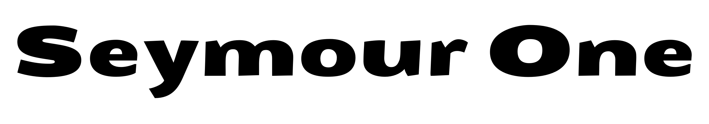
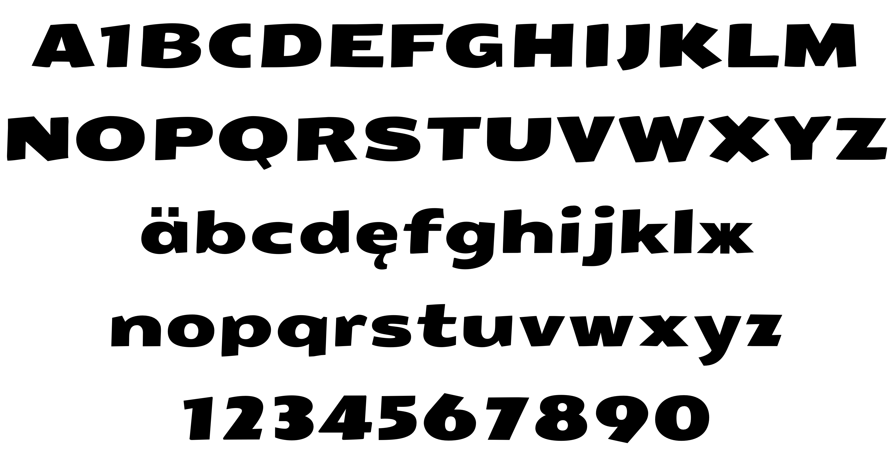

# Seymour One
By Vernon Adams

Seymour One is derived from the earlier webfont Sigmar One, but the forms have also been influenced by late nineteenth and early twentieth century British sans-serif typefaces. The result is a display face that is ideal for bold, unpretentious, and slightly playful display typography. Seymour One is designed to be used conventionally but also as an 'all caps' font.

## License

Licensed under the [SIL Open Font License, 1.1](http://scripts.sil.org/OFL); you may only use these files in compliance with the License.

To contribute to the project, file an issue at https://github.com/googlefonts/Tienne2Font